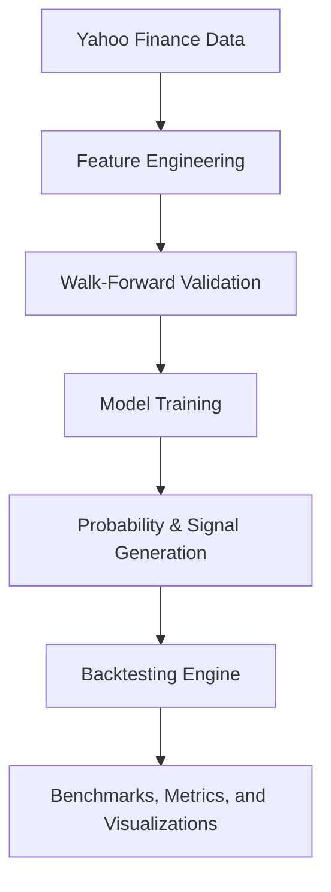
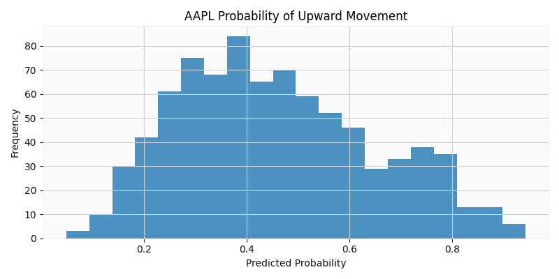
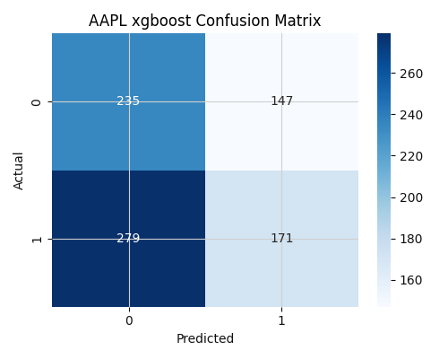

# QuantLab AI

QuantLab AI is a production-style quantitative machine learning platform for equity research. It ingests market data, engineers technical and market-context features, trains multiple model families, and evaluates signal-driven strategies with walk-forward validation and benchmark-aware backtesting.

This project is designed to feel closer to a junior quant research or ML engineering platform than a notebook demo. The goal is not to claim a magic stock predictor. The goal is to show realistic research workflow, disciplined evaluation, and strong software engineering structure.

## Research Focus

QuantLab AI is built around a simple idea: classification signal and tradable edge are not the same thing. A model can show some ability to predict next-day direction while still failing to produce a robust trading strategy after realistic temporal validation, turnover, and benchmark comparison. This project is designed to study that gap directly.

## Tech Stack

`Python` • `FastAPI` • `Next.js` • `React` • `pandas` • `NumPy` • `scikit-learn` • `XGBoost` • `PyTorch` • `SQLite` • `Matplotlib` • `Seaborn` • `yfinance` • `Vercel`

## What It Does

- Downloads historical equity data with `yfinance`
- Builds technical features such as moving averages, RSI, volatility, momentum, returns, and volume signals
- Expands the feature space with MACD, Bollinger Bands, ATR, and OBV-derived signals
- Adds market-context features from `SPY`, including relative strength, rolling beta, and rolling correlation
- Trains multiple models:
  - Logistic Regression
  - Random Forest
  - XGBoost
  - PyTorch LSTM
- Converts model probabilities into trading signals
- Evaluates strategies with expanding-window walk-forward validation
- Tunes probability thresholds before final backtesting
- Runs cross-ticker batch studies for multi-asset comparison
- Backtests signals against benchmark strategies:
  - buy-and-hold
  - always-long exposure
  - naive momentum
- Saves models, metrics, trade logs, and charts for later review

## Why This Project Is Stronger Than a Typical ML Stock Repo

- Modular Python application instead of notebook-only code
- Clear package boundaries for data, features, models, backtesting, and visualization
- Time-aware validation instead of a single random split
- Benchmark comparison instead of evaluating the model in isolation
- Honest reporting of where models fail to produce robust alpha

## Repository Structure

```text
quantlab-ai/
├── api/                    # Future API layer
├── backtesting/            # Trade logs and summary reports
├── data/
│   ├── processed/          # Feature-engineered datasets
│   └── raw/                # Cached market data
├── models/                 # Saved sklearn and PyTorch artifacts
├── notebooks/              # Experiments only
├── src/
│   └── quantlab_ai/
│       ├── backtesting/    # Strategy simulation engine
│       ├── data/           # Download and persistence logic
│       ├── features/       # Indicators and dataset construction
│       ├── models/         # Classical ML and LSTM trainers
│       ├── visualization/  # Plot generation
│       ├── config.py       # Runtime settings
│       ├── cli.py          # Command-line entrypoint
│       └── pipeline.py     # End-to-end orchestration
├── visualizations/         # Exported charts
├── requirements.txt
└── pyproject.toml
```

## Architecture

1. Download price history for a target asset
2. Download `SPY` as market context
3. Build technical and relative-performance features
4. Generate next-day direction labels
5. Train models using expanding-window walk-forward validation
6. Produce out-of-sample probabilities and signals
7. Backtest the resulting strategy against baseline rules
8. Save metrics, charts, and serialized models



## Feature Set

### Technical features

- 1-day and 5-day returns
- 10-day and 20-day moving averages
- 10-day and 20-day exponential moving averages
- 10-day momentum
- 10-day annualized volatility
- RSI
- intraday range
- overnight gap
- volume ratio versus rolling average
- MACD line, signal, and histogram
- Bollinger Band width and percent-B
- Normalized 14-day ATR
- 20-day OBV z-score

### Market-context features

- `SPY` 1-day return
- `SPY` 5-day return
- 5-day relative strength versus `SPY`
- 20-day rolling beta versus `SPY`
- 20-day rolling correlation versus `SPY`

## Models

- `logistic_regression`
- `random_forest`
- `xgboost`
- `lstm`

## How To Run

### 1. Create an environment

```bash
python3 -m venv .venv
source .venv/bin/activate
pip install -r requirements.txt
```

### 2. Run a model

```bash
PYTHONPATH=src python3 -m quantlab_ai.cli run \
  --ticker AAPL \
  --start 2018-01-01 \
  --end 2026-05-25 \
  --model xgboost
```

### 3. Try a deep learning baseline

```bash
PYTHONPATH=src python3 -m quantlab_ai.cli run \
  --ticker AAPL \
  --start 2018-01-01 \
  --end 2026-05-25 \
  --model lstm
```

### 4. Run a cross-ticker batch study

```bash
PYTHONPATH=src python3 -m quantlab_ai.cli run-batch \
  --tickers AAPL MSFT NVDA SPY QQQ \
  --start 2018-01-01 \
  --end 2026-05-25 \
  --model xgboost
```

### 5. Run the Vercel-style web demo locally

```bash
npm install
npm run dev
```

## Outputs

- `data/raw/`: cached ticker and market data
- `data/processed/`: feature-engineered training table
- `data/quantlab.db`: experiment metadata
- `models/`: persisted trained artifacts
- `backtesting/`: strategy summaries, benchmarks, and trade logs
- `visualizations/`: candlestick charts, confusion matrices, probability histograms, and equity curves

## Web Demo

The public-facing demo is now structured as a `Next.js` frontend with lightweight Python API endpoints for benchmark and live-signal data. This makes the project easier to deploy on `Vercel` and presents the research more like a real product than a notebook dashboard.

## Latest Public Benchmark Snapshot

The latest public results reflect the upgraded evaluation stack: expanding-window walk-forward validation, threshold tuning, multi-ticker comparison, and benchmark-aware backtesting.

## Model Classification Metrics

The table below summarizes fold-averaged out-of-sample classification quality from the current five-ticker `XGBoost` basket after feature expansion.

| Ticker | Mean Accuracy | Mean Precision | Mean Recall | Mean F1 | Mean ROC-AUC | Best Threshold |
| --- | ---: | ---: | ---: | ---: | ---: | ---: |
| `AAPL` | `0.488` | `0.544` | `0.380` | `0.442` | `0.484` | `0.55` |
| `MSFT` | `0.516` | `0.560` | `0.476` | `0.505` | `0.525` | `0.60` |
| `NVDA` | `0.502` | `0.578` | `0.366` | `0.442` | `0.529` | `0.50` |
| `SPY` | `0.507` | `0.600` | `0.448` | `0.486` | `0.514` | `0.50` |
| `QQQ` | `0.499` | `0.598` | `0.462` | `0.468` | `0.488` | `0.60` |
| **Basket Mean** | **`0.502`** | **`0.576`** | **`0.426`** | **`0.469`** | **`0.508`** | — |

## Cross-Ticker XGBoost Results

| Ticker | Strategy Return | Buy & Hold | Sharpe Ratio | Max Drawdown | Trades |
| --- | ---: | ---: | ---: | ---: | ---: |
| `AAPL` | `+12.99%` | `+111.07%` | `0.26` | `-21.11%` | `252` |
| `MSFT` | `+38.03%` | `+74.60%` | `0.63` | `-28.71%` | `252` |
| `NVDA` | `+452.28%` | `+1058.34%` | `1.62` | `-21.80%` | `291` |
| `SPY` | `+30.54%` | `+84.37%` | `0.69` | `-12.90%` | `354` |
| `QQQ` | `+20.48%` | `+144.28%` | `0.50` | `-15.78%` | `257` |
| **Basket Mean** | **`+110.86%`** | — | **`0.74`** | — | — |

The arithmetic mean return is heavily influenced by `NVDA`, so the website uses median strategy return for a more stable cross-ticker summary.

## Key Findings

- Feature expansion improved the public `XGBoost` basket modestly: mean walk-forward accuracy moved above `50%`, and mean ROC-AUC improved to roughly `0.508`.
- Signal quality remains weak to moderate overall, which is exactly why the project emphasizes honest validation over headline returns.
- Cross-ticker results are heterogeneous: `MSFT` and `SPY` look relatively stable, `AAPL` remains weak, and `NVDA` contributes disproportionately to average returns.
- The strategy still generally trails passive exposure across names, reinforcing the core lesson that predictive signal and tradable alpha are not the same thing.

## Research Lessons

- Walk-forward validation exposed substantial performance decay relative to earlier single-split experiments and prevented overclaiming.
- Feature engineering mattered more than swapping in more complex models blindly; the indicator expansion helped more than threshold changes alone.
- Benchmark comparisons were essential because some individual backtests looked attractive even when classification quality stayed close to random.
- Multi-ticker evaluation showed that whatever signal exists is highly asset-dependent and likely regime-sensitive.
- This is a stronger research platform because it surfaces those weaknesses transparently instead of hiding them.

## Visuals

### XGBoost equity curve


### XGBoost probability distribution



### XGBoost confusion matrix



### AAPL candlestick chart


## Roadmap

- Add feature ablations comparing technical-only, market-context-only, and combined feature sets
- Extend experiments across more equities, sectors, and regime buckets
- Add realistic slippage assumptions alongside existing transaction costs
- Add unit tests for indicators, validation logic, and backtesting correctness
- Expose latest predictions through a lightweight API
- Add GitHub Actions and Docker for reproducibility

## Demo Deployment

The recommended deployment path for the website is `Vercel`.

1. Push this repository to GitHub
2. Import the repository into Vercel
3. Let Vercel detect the `Next.js` frontend automatically
4. Deploy the project so the frontend and Python API functions ship together
5. Share the generated public URL

This repository uses:

- a `Next.js` frontend in `app/`
- Python API endpoints in `api/`
- committed demo assets and JSON snapshots under `docs/` and `public/`

Useful references:

- [Next.js on Vercel](https://vercel.com/docs/frameworks/nextjs)
- [FastAPI on Vercel](https://vercel.com/docs/frameworks/backend/fastapi)
- [Python runtime on Vercel](https://vercel.com/docs/functions/runtimes/python)

## Notes

Notebooks are included only for experimentation. The primary deliverable is the Python application itself: structured, extensible, and designed to evolve into a more advanced quant research stack.
