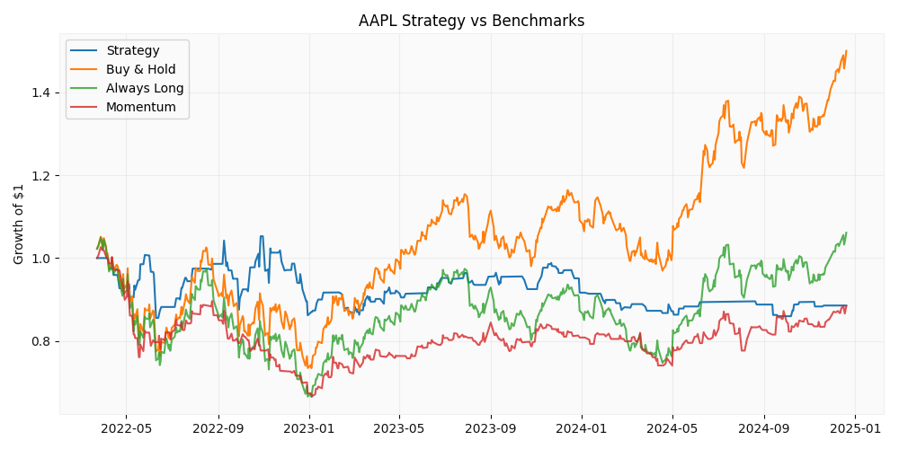
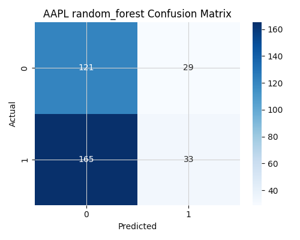
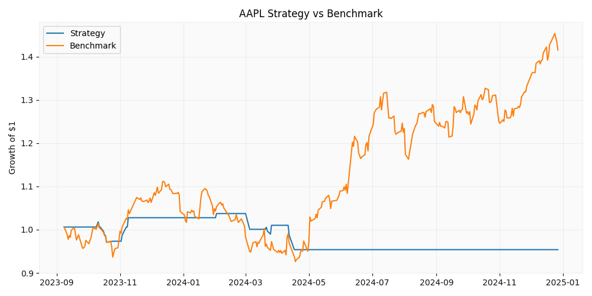
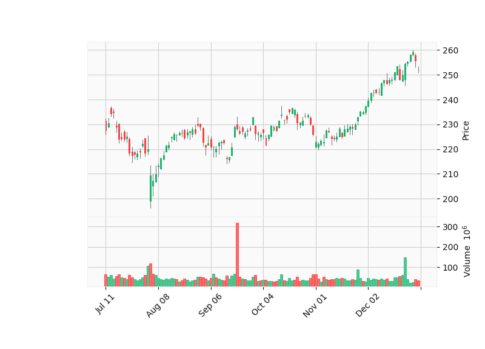

# QuantLab AI

QuantLab AI is a production-style quantitative machine learning platform for equity research. It ingests market data, engineers technical and market-context features, trains multiple model families, and evaluates signal-driven strategies with walk-forward validation and benchmark-aware backtesting.

This project is designed to feel closer to a junior quant research or ML engineering platform than a notebook demo. The goal is not to claim a magic stock predictor. The goal is to show realistic research workflow, disciplined evaluation, and strong software engineering structure.

## What It Does

- Downloads historical equity data with `yfinance`
- Builds technical features such as moving averages, RSI, volatility, momentum, returns, and volume signals
- Adds market-context features from `SPY`, including relative strength, rolling beta, and rolling correlation
- Trains multiple models:
  - Logistic Regression
  - Random Forest
  - XGBoost
  - PyTorch LSTM
- Converts model probabilities into trading signals
- Evaluates strategies with expanding-window walk-forward validation
- Backtests signals against benchmark strategies:
  - buy-and-hold
  - always-long exposure
  - naive momentum
- Saves models, metrics, trade logs, and charts for later review

## Why This Project Is Stronger Than a Typical ML Stock Repo

- Modular Python application instead of notebook-only code
- Clear package boundaries for data, features, models, backtesting, and visualization
- Time-aware validation instead of a single random split
- Benchmark comparison instead of evaluating the model in isolation
- Honest reporting of where models fail to produce robust alpha

## Repository Structure

```text
quantlab-ai/
├── api/                    # Future API layer
├── backtesting/            # Trade logs and summary reports
├── data/
│   ├── processed/          # Feature-engineered datasets
│   └── raw/                # Cached market data
├── models/                 # Saved sklearn and PyTorch artifacts
├── notebooks/              # Experiments only
├── src/
│   └── quantlab_ai/
│       ├── backtesting/    # Strategy simulation engine
│       ├── data/           # Download and persistence logic
│       ├── features/       # Indicators and dataset construction
│       ├── models/         # Classical ML and LSTM trainers
│       ├── visualization/  # Plot generation
│       ├── config.py       # Runtime settings
│       ├── cli.py          # Command-line entrypoint
│       └── pipeline.py     # End-to-end orchestration
├── visualizations/         # Exported charts
├── requirements.txt
└── pyproject.toml
```

## Architecture

1. Download price history for a target asset
2. Download `SPY` as market context
3. Build technical and relative-performance features
4. Generate next-day direction labels
5. Train models using expanding-window walk-forward validation
6. Produce out-of-sample probabilities and signals
7. Backtest the resulting strategy against baseline rules
8. Save metrics, charts, and serialized models

## Feature Set

### Technical features

- 1-day and 5-day returns
- 10-day and 20-day moving averages
- 10-day and 20-day exponential moving averages
- 10-day momentum
- 10-day annualized volatility
- RSI
- intraday range
- overnight gap
- volume ratio versus rolling average

### Market-context features

- `SPY` 1-day return
- `SPY` 5-day return
- 5-day relative strength versus `SPY`
- 20-day rolling beta versus `SPY`
- 20-day rolling correlation versus `SPY`

## Models

- `logistic_regression`
- `random_forest`
- `xgboost`
- `lstm`

## How To Run

### 1. Create an environment

```bash
python3 -m venv .venv
source .venv/bin/activate
pip install -r requirements.txt
```

### 2. Run a model

```bash
PYTHONPATH=src python3 -m quantlab_ai.cli run \
  --ticker AAPL \
  --start 2018-01-01 \
  --end 2024-12-31 \
  --model xgboost
```

### 3. Try a deep learning baseline

```bash
PYTHONPATH=src python3 -m quantlab_ai.cli run \
  --ticker AAPL \
  --start 2018-01-01 \
  --end 2024-12-31 \
  --model lstm
```

## Outputs

- `data/raw/`: cached ticker and market data
- `data/processed/`: feature-engineered training table
- `data/quantlab.db`: experiment metadata
- `models/`: persisted trained artifacts
- `backtesting/`: strategy summaries, benchmarks, and trade logs
- `visualizations/`: candlestick charts, confusion matrices, probability histograms, and equity curves

## Latest Public Benchmark Snapshot

The latest benchmark below reflects the upgraded evaluation setup: expanding-window walk-forward validation plus baseline comparison. This is a more realistic measure of signal quality than the earlier single-split experiments.

### AAPL walk-forward XGBoost results

| Metric | Strategy | Buy & Hold | Always Long | Momentum |
| --- | ---: | ---: | ---: | ---: |
| Total return | `-36.87%` | `+48.17%` | `+4.63%` | `-11.61%` |
| Max drawdown | `-43.87%` | `-30.14%` | `-36.61%` | `-35.09%` |
| Sharpe ratio | `-1.02` | `0.63` | `0.16` | `-0.20` |
| Win rate | `45.35%` | `53.74%` | `52.44%` | `28.30%` |
| Trade count | `172` | `696` | `696` | `374` |

## Key Findings

- Walk-forward validation materially reduced the apparent performance of the baseline models, which is exactly why time-aware evaluation matters.
- The current `xgboost` strategy beats the naive momentum rule, but still fails to outperform passive exposure.
- The platform demonstrates that classification signal and tradable edge are not the same thing.
- Adding market-context features improves the realism of the feature space and creates a stronger foundation for future iteration.
- The project is most compelling as a quantitative research system that identifies weaknesses honestly, not as a claim of market-beating performance.

## Visuals

### XGBoost equity curve



### Random Forest confusion matrix



### LSTM equity curve



### AAPL candlestick chart



## Roadmap

- Tune probability thresholds to reduce overtrading
- Add MACD, Bollinger Bands, ATR, and OBV features
- Extend experiments across `MSFT`, `NVDA`, `SPY`, and sector ETFs
- Add unit tests for indicators and backtesting correctness
- Add a lightweight API for serving latest predictions
- Add GitHub Actions and Docker for reproducibility

## Notes

Notebooks are included only for experimentation. The primary deliverable is the Python application itself: structured, extensible, and ready to grow into a more advanced quant research stack.
